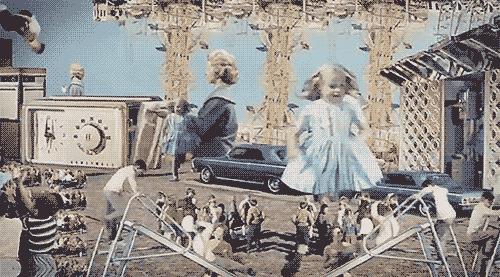
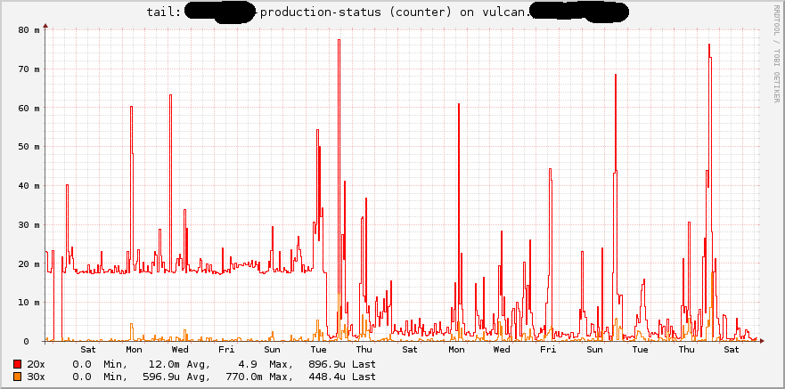
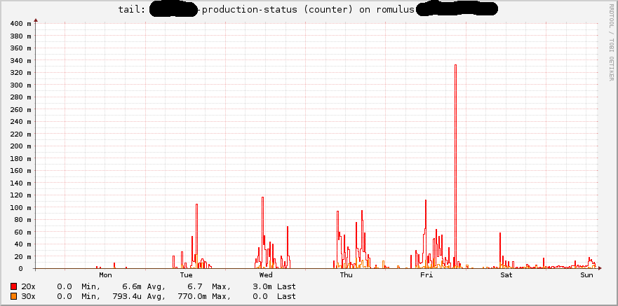

!SLIDE transition=fade

&nbsp;

!SLIDE transition=fade

# Why the log should I hell?

!SLIDE bullets incremental

## Logfiles provide insight
* we hope

!SLIDE top small

## checking raw logs

This image is protected by copyright. All rights to this image are located at
Village Roadshow Pictures and/or Warner Bros. Entertainment, and any
subsidiary or third party companies. It is used as a picture quotation
according to § 51 UrhG (Urhebergesetz, German Copyright Act) solely for
substantive explanation.  The image must not be altered. Picture quotations may only
be used in direct connection. A correct and accurate source of information
is essential.

!SLIDE top small

## checking raw logs

© by [@dcamart](https://twitter.com/dcamart)  
via [Infosec Reactions](http://securityreactions.tumblr.com/post/54913301850/checking-raw-logs)

!SLIDE

# visualize the log

!SLIDE top

## visualize

When did the monitoring on this machine change?

!SLIDE top

## visualize II

Appreciate the slow start of a new app…

!SLIDE top bullets

## visualize crazily
* [glTail](http://www.fudgie.org/)
* [logstalgia](https://code.google.com/p/logstalgia/)
