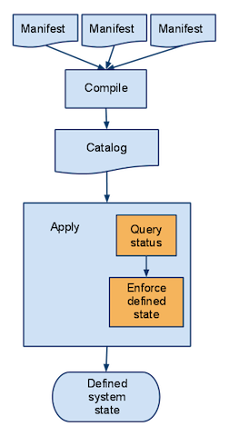
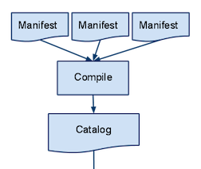

!SLIDE transition=fade bullets

# Puppet #

!SLIDE bullets incremental

# Puppet #

* IT automation software
* declarative external DSL
* compiled into a catalog
* applied to system

!SLIDE bullets incremental small

# Terms #

* node = machine in your system
* master = central puppet server
* agent = service applying changes
* fact = piece of data from a node
* class = description of an aspect of a node
* manifest = description of a node

!SLIDE center image

!SLIDE center image

!SLIDE center image

!SLIDE bullets incremental

# The Catalog #
* can be compiled without harm
* is always specific to a node
* depends on the nodes facts
* is a directed graph
* is a ruby datastructure

